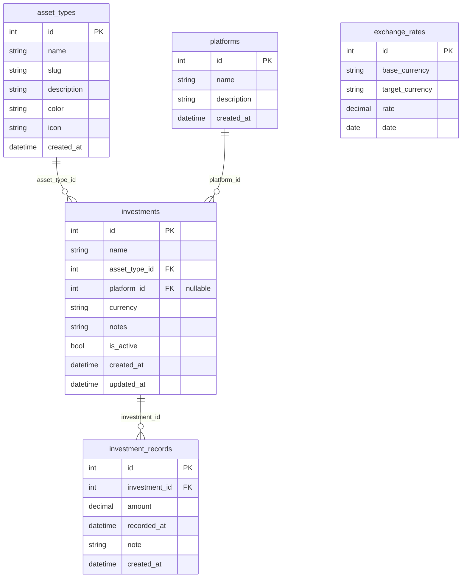

# Esquema de base de datos

## Diagrama de relaciones

---

## Tablas

### `asset_types`

Tipos de activo configurables desde la UI (acciones, ETFs, cripto, etc.).

| Columna | Tipo | Restricciones | Descripción |
|---|---|---|---|
| `id` | INTEGER | PK, autoincrement | |
| `name` | VARCHAR(100) | NOT NULL, UNIQUE | Nombre visible en la UI |
| `slug` | VARCHAR(100) | NOT NULL, UNIQUE | Identificador legible para código |
| `description` | VARCHAR(500) | nullable | Descripción opcional |
| `color` | VARCHAR(7) | NOT NULL, default `#6366f1` | Color hex para badges en la UI |
| `icon` | VARCHAR(50) | NOT NULL, default `wallet` | Nombre del icono |
| `created_at` | DATETIME | NOT NULL, default now | |

---

### `platforms`

Brokers o plataformas donde se mantienen las inversiones.

| Columna | Tipo | Restricciones | Descripción |
|---|---|---|---|
| `id` | INTEGER | PK, autoincrement | |
| `name` | VARCHAR(100) | NOT NULL, UNIQUE | Nombre de la plataforma |
| `description` | VARCHAR(500) | nullable | Descripción opcional |
| `created_at` | DATETIME | NOT NULL, default now | |

---

### `investments`

Posiciones de inversión. Cada fila representa un activo que el usuario posee o poseyó.

| Columna | Tipo | Restricciones | Descripción |
|---|---|---|---|
| `id` | INTEGER | PK, autoincrement | |
| `name` | VARCHAR(200) | NOT NULL | Nombre descriptivo de la inversión |
| `asset_type_id` | INTEGER | NOT NULL, FK → `asset_types.id` | Tipo de activo |
| `platform_id` | INTEGER | nullable, FK → `platforms.id` | Plataforma donde se mantiene |
| `currency` | VARCHAR(10) | NOT NULL | Moneda original (ej. `USD`, `CLP`, `BTC`) |
| `notes` | VARCHAR(1000) | nullable | Notas libres |
| `is_active` | BOOLEAN | NOT NULL, default `true` | Permite marcar posiciones cerradas sin eliminarlas |
| `created_at` | DATETIME | NOT NULL, default now | |
| `updated_at` | DATETIME | NOT NULL, default now, onupdate now | |

---

### `investment_records`

Historial de valores de cada inversión en su moneda original. Cada fila es un snapshot puntual.

| Columna | Tipo | Restricciones | Descripción |
|---|---|---|---|
| `id` | INTEGER | PK, autoincrement | |
| `investment_id` | INTEGER | NOT NULL, FK → `investments.id` (cascade delete) | |
| `amount` | NUMERIC(20,6) | NOT NULL | Valor de la inversión en la fecha indicada |
| `recorded_at` | DATETIME | NOT NULL | Momento al que corresponde el valor |
| `note` | VARCHAR(500) | nullable | Nota opcional (ej. "rendimiento mensual") |
| `created_at` | DATETIME | NOT NULL, default now | Cuándo se registró la fila |

---

### `exchange_rates`

Tipos de cambio históricos descargados desde `open.er-api.com`.

| Columna | Tipo | Restricciones | Descripción |
|---|---|---|---|
| `id` | INTEGER | PK, autoincrement | |
| `base_currency` | VARCHAR(10) | NOT NULL | Moneda origen (ej. `USD`) |
| `target_currency` | VARCHAR(10) | NOT NULL | Moneda destino (ej. `CLP`) |
| `rate` | NUMERIC(20,8) | NOT NULL | Tasa de conversión (`1 base = rate target`) |
| `date` | DATE | NOT NULL | Fecha a la que aplica la tasa |

Constraint UNIQUE sobre `(base_currency, target_currency, date)`.

---

## Relaciones

| Desde | Hacia | Cardinalidad | Nota |
|---|---|---|---|
| `investments.asset_type_id` | `asset_types.id` | N → 1 | Obligatoria |
| `investments.platform_id` | `platforms.id` | N → 1 | Opcional (nullable) |
| `investment_records.investment_id` | `investments.id` | N → 1 | Cascade delete |
